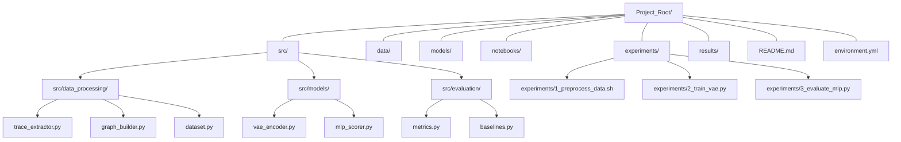

<div style="display: flex; justify-content: space-around; align-items: center; width: 100%;">
  
  
</div>

-----

# Hallucination Detection in LLM's with GML

This repository contains the source code for the _Graph Machine Learning (IIC3675)_ project by the lecturer Marcelo Mendoza (PUC) and authors Nicolás Schiaffino & Gabriel Venegas (UTFSM).

# Graphical Abstract

# 📁 Project Repository Structure for LLM Hallucination Detection

Here is the description of the suggested repository structure in Markdown, followed by a Tree Diagram, designed for maximum modularity and academic rigor.

-----

### Repository Structure Description

This structure is organized to support the entire research lifecycle, from data processing to final result generation, emphasizing **reproducibility** and **modular code**.

| Directory | Content | Academic Rigor Justification |
| :--- | :--- | :--- |
| **`src/`** | Modular source code (Models, Pipeline components, Utilities). The core of the project. | Fosters **modularity**, allowing for the reuse of functions and classes (e.g., `VAE.py`, `GNN_Layer.py`) for clear logic separation. |
| **`data/`** | Scripts for downloading and preprocessing data. **Never** upload large `.pt` or `.pkl` files here. | Ensures **dataset reproducibility**. Only the generation scripts (e.g., `generate_llama_traces.py`) should be included. |
| **`models/`** | Trained model weights (`.pth` files). | Critical for **immediate replicability**. Users can verify results without requiring full retraining. |
| **`notebooks/`** | Jupyter Notebooks for exploration, prototyping, and analysis. | Ideal for **Exploratory Data Analysis (EDA)**, debugging the VAE, and visualizing training metrics (*loss curves*). |
| **`experiments/`** | Final scripts for training and evaluation runs. | Separates the final **execution code** from the modular development code. |
| **`results/`** | Tables, charts, and figures for the final report. The key deliverable. | Stores raw results and figures automatically generated by the evaluation scripts. |

-----

### 🌳 Tree Diagram



### Corresponding File System Tree

```
Project_Root/
├── src/
│   ├── data_processing/
│   │   ├── trace_extractor.py      # Extracts LLM hidden states/attention
│   │   ├── graph_builder.py        # Converts traces to attributed graphs G_l
│   │   └── dataset.py              # Dataloader for graph sequences {G_l}
│   ├── models/
│   │   ├── vae_encoder.py          # Graph VAE implementation
│   │   └── mlp_scorer.py           # Hallucination scoring MLP over Z_l
│   └── evaluation/
│       ├── metrics.py              # AUROC, AUPR calculation
│       └── baselines.py            # HaloScope, HalluShift, CHARM score functions
├── data/                           # Scripts only (e.g., generate_llama_traces.py)
├── models/                         # Trained model weights (.pth)
├── notebooks/                      # EDA and prototyping notebooks
├── experiments/
│   ├── 1_preprocess_data.sh        # Executes data pipeline
│   ├── 2_train_vae.py              # VAE training script
│   └── 3_evaluate_mlp.py           # Final evaluation and comparison
├── results/                        # Final tables, charts, and figures
├── README.md                       # Project documentation
└── environment.yml                 # Dependency list
```

# ToDo

### Avance
- [x] ~~Implementar Llama-3.2-1B~~ **ACTUALIZADO: Qwen3-4B-Instruct** y generar las respuestas de las preguntas de ~~_TruthfulQA_~~ **TriviaQA**
- [x] Crear script para extraer las atenciones y embeddings de todas las capas para la respuesta generada (`trace_extractor.py`)
- [x] Procesar todas las respuestas con el script para recuperar atenciones y embeddings
- [x] Generar el dataset con cada fila como `[id_pregunta, respuesta, atenciones_capa_k, activaciones_capa_k, ..., atenciones_capa_N, activaciones_capa_N]`
- [ ] Implementar un proceso de carga de cada fila de dataset para generar el Grafo (`dataloader`)
- [ ] Implementar VAE para grafos

### Entrega Final
- [ ] Entrenar el VAE de forma no supervisada sobre el dataset mixto
- [ ] Implementar scripts de scoring de alucinaciones (MLP) sobre la secuencia de z_l
- [ ] Implementar HaloScope & HalluShift para comparación
- [ ] Ejecutar evaluación en dataset de test y generar gráficos comparativos

### Propuesta 
- [x] Graphical abstract.
- [x] Problema que se aborda en el proyecto.
- [x] Técnicas a utilizar.
- [x] Datos con los que se va a trabajar.
- [x] Elementos Diferenciadores
- [x] Plan de actividades, Entregables al avance y a la entrega final.
- [x] Video de 3 minutos.

---

## 🚀 Últimas Actualizaciones

### Implementación Fase de Avance (Actualizado)

**Modelo**: `Qwen/Qwen3-4B-Instruct-2507` (reemplaza Llama-3.2-1B)  
**Dataset**: `TriviaQA` (mandarjoshi/trivia_qa, rc.nocontext) (reemplaza TruthfulQA)

#### Archivos Implementados:

1. **`src/trace_extractor.py`** - Extractor principal de trazas
   - Carga el modelo Qwen3-4B-Instruct con cuantización 8-bit
   - Procesa preguntas de TriviaQA
   - Extrae **hidden states** y **attention matrices** de todas las capas
   - Guarda datos en `./traces_data/trivia_qa_traces_*.pkl`

2. **`src/inspect_traces.py`** - Script de inspección de datos
   - Carga y analiza los traces guardados
   - Muestra estadísticas del dataset
   - Visualiza ejemplos y dimensiones

3. **Documentación**:
   - `src/README_trace_extractor.md` - Guía detallada del extractor
   - `CAMBIOS_IMPLEMENTADOS.md` - Resumen de cambios realizados

#### Uso Rápido:

```bash
# Extraer trazas (por defecto 100 ejemplos)
python src/trace_extractor.py

# Inspeccionar datos extraídos
python src/inspect_traces.py
```

#### Estructura de Datos Extraídos:

Cada trace contiene:
- `hidden_states`: `[num_layers][num_tokens][batch, seq_len, hidden_dim]`
- `attentions`: `[num_layers][num_tokens][batch, num_heads, seq_len, seq_len]`
- Metadata: pregunta, respuesta, tokens, ground truth answers

Ver `src/README_trace_extractor.md` para más detalles.